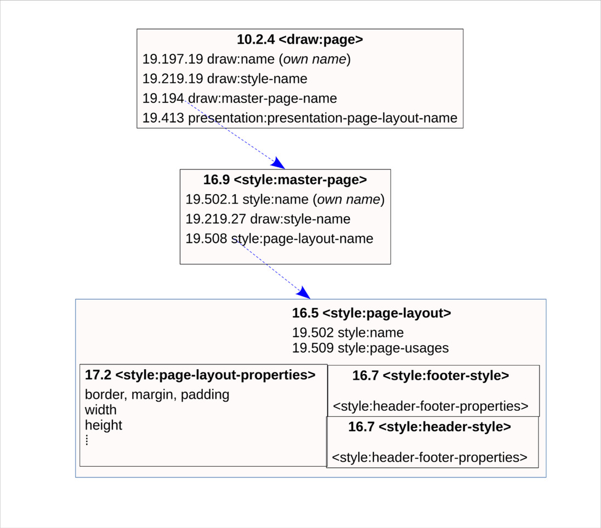

+++
date = '2025-10-27T18:30:52+05:30'
draft = false
title = 'Supporting Per-Slide Size Support in Impress'
+++

## Overview

Previously, Impress only allowed a single size for the whole presentation (even in `.odp`). The [ODF standard](https://www.oasis-open.org/standard/opendocumentv1-2/), however, does not impose such restrictions.
Supporting differently-sized slides in a presentation is the first step towards implementing [Infinite Canvas](https://nlnet.nl/project/InfiniteCanvas/) in [Collabora Online](https://www.collaboraonline.com/).
LibreOffice will also benefit from this feature.

Thanks to [nlnet Foundation](https://nlnet.nl/) for sponsoring this project!

## Implementation

An ODP file is essentially a ZIP archive containing several XML files and resources.
```bash
.
├── Configurations2
├── content.xml
├── META-INF
│   └── manifest.xml
├── meta.xml
├── mimetype
├── settings.xml
├── styles.xml
└── Thumbnails
    └── thumbnail.png

4 directories, 7 files
```

`styles.xml` contains `<style:page-layout>` which specifies formatting properties of a page. It has a child element `<style:page-layout-properties>` which contains the width & height of a page.
This page-layout element is referenced by `<style:master-page>` which represents a master page.
Now, the slide in the presentation document is represented by `<draw:page>` element which resides in `content.xml`. The slide inherits the width & height from the master page.



So to have multiple sized slides, new master pages needed to be created when the user resized a single slide [[2]](#commit-2). However, this wasn't enough as if you had save the file & re-open it, all the slides would have same size.
This was because while importing the file, Impress used to force all the master-pages to have same size. So this needed to be fixed as well [[1]](#commit-1).
After these patches, multiple-sized files were possible in Impress. Now this should work perfectly in Collabora Online as well.


Or so I thought. You see, just like the import, there were multiple places in the codebase where it was assumed that all the pages in the file have same size. One such place was LibreOfficeKit (LOK), which is an API used by Collabora Online
to communicate with LibreOffice (see https://sdk.collaboraonline.com/docs/architecture.html for how it works). Since LOK tells the client that all the pages have same size, the client would just cut off the content of a page having bigger size.
The initial solution was to trick the client that the document has been resized when it switched to a page having differnt size, so that it would render the page properly, but there was a side-effect. It invalidated all the previews in the slide-sorter which would
force it to re-render each time the user switched to a different-sized slide, which is unnecessary and quite expensive. So the idea is to send a status update which the client would handle by setting the correct view size for the page [[3]](#commit-3),
[[4]](#commit-4), [[5]](#commit-5).

## Demo

<video width="640" height="360" controls>
  <source src="demo.mp4" type="video/mp4">
  Your browser does not support the video tag.
</video>

The commits for this feature:

<a id="commit-1"></a>[1] [sd: don't force all the master pages to have same size while importing](https://gerrit.libreoffice.org/c/core/+/191523)

<a id="commit-2"></a>[2] [cool#13066 support multiple slide size in Impress](https://gerrit.libreoffice.org/c/core/+/191524)

<a id="commit-3"></a>[3] [lok: handle switching to page having different size](https://gerrit.libreoffice.org/c/core/+/192004)

<a id="commit-4"></a>[4] [Impress: fix preview rendering when switching to a page having different size](https://github.com/CollaboraOnline/online/pull/13121)

<a id="commit-5"></a>[5] [Impress: initialize preview size according to it's page size](https://github.com/CollaboraOnline/online/pull/13266)

<a id="commit-6"></a>[6] [slideshow: re-calculate canvas size if the slide has different size](https://github.com/CollaboraOnline/online/pull/13211)


